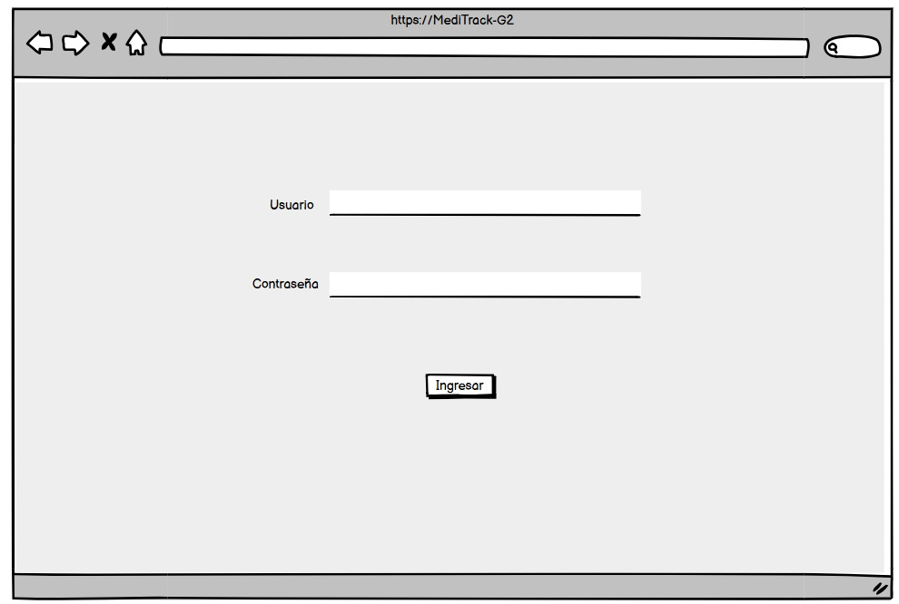

# **MANUAL DE USUARIO**
MediTrack es un sistema de monitoreo hospitalario diseñado para optimizar la supervisión de pacientes en camillas inteligentes mediante sensores biomédicos y tecnologías IoT. Su objetivo es proporcionar un monitoreo en tiempo real de signos vitales, facilitando la toma de decisiones médicas y mejorando la eficiencia en la atención hospitalaria.

El sistema permite la captura y visualización de señales ECG y niveles de oxígeno, enviando los datos a un servidor a través de comunicación serial. Para garantizar la seguridad, incorpora autenticación por RFID, asegurando que solo personal autorizado pueda acceder a la información del paciente. La interfaz web interactiva ofrece un dashboard donde se pueden visualizar los datos clínicos, mientras que la API REST facilita la integración y gestión remota del sistema.

Entre sus principales funcionalidades, MediTrack permite la digitalización de fichas médicas, la gestión automatizada del alta de pacientes y la generación de reportes en formato PDF. Además, emplea FreeRTOS o interrupciones para mejorar la gestión de tareas en el sistema embebido, y requiere la configuración de un servidor LAN/WAN para la conectividad remota, se proporciona las instrucciones necesarias para la instalación, configuración y uso del sistema, garantizando su correcta operación y aprovechamiento. Con MediTrack, se busca mejorar la calidad y rapidez en la atención médica, ofreciendo una solución accesible y eficiente para hospitales con alta demanda de pacientes.

------
## FUNCIONALIDADES DEL PROYECTO
### Captura de señales ECG (Electrocardiograma)
* Cada camilla está equipada con un sensor ECG, el cual mide la actividad eléctrica del corazón del paciente.
* La señal ECG se visualiza como un trazado en la interfaz del sistema, permitiendo a los médicos identificar posibles anomalías cardíacas.
* La información es recolectada en tiempo real y enviada a la plataforma para su análisis.
### Medición de niveles de oxígeno en la sangre
* El sistema utiliza un sensor de oxígeno MD-MAX30102 que mide la saturación de oxígeno en la sangre.
* Estos valores se muestran junto a la señal ECG en la interfaz de monitoreo.

### Envío de datos a la plataforma
* Los datos recolectados por los sensores son transmitidos al sistema mediante comunicación UART/USB.
* La API REST permite que la información esté disponible para su consulta desde la interfaz web.

### Autenticación y Control de Acceso
#### Autenticación del personal médico
* Solo los médicos autorizados pueden acceder a la información del paciente mediante una tarjeta RFID.
* Al escanear la tarjeta en el sensor RFID de la camilla, se desbloquea la ficha médica del paciente.
* Una vez finalizada la consulta, el sistema permite bloquear nuevamente el acceso para proteger los datos.

#### Protección de la ficha médica
* Hasta que un médico autorizado utilice su llave RFID, los datos del paciente permanecen bloqueados.
* Esto evita que personas no autorizadas puedan visualizar o modificar la información.

### Plataforma Web Interactiva
#### Visualización en tiempo real
* La interfaz web muestra en un dashboard los datos del paciente, incluyendo el ECG y el nivel de oxígeno en la sangre.
* La información se actualiza en tiempo real conforme se reciben los datos desde la camilla.

### Acceso remoto mediante API REST
* La plataforma permite que los datos sean consultados desde cualquier dispositivo autorizado dentro de la red hospitalaria.
* La API REST facilita la integración del sistema con otros registros médicos electrónicos.

### Explicación de uso
#### Pestaña de Inicio
* Al ingresar a la aplicación la pimera ventana que se despliega es la del inicio de secion. 
* En esta ventana el doctor debe ingresar sus credenciales, es decir usuario y contraseña

A continuación se muestra la vista desde un dispositivo mobil y una pagina Web

#### Editar información del paciente
En la parte superior izquierda se vizualiza un despliegue de botones donde puede acceder a las diferentes ventanas.
* Dependiendo los permisos del doctor tendrá la opcion de editar la información del paciente.
* En la parte superior se vizualiza un buscador que se encarga de buscar el cui del paciente especifico.
* En esta ventana se vizualiza una tabla con la información de los pacientes y en la ultima columna un boton EDITAR.
* Presione el boton EDITAR de la fila correspondiente al paciente que desea editar. Este botón le abrirá una nueva ventana.

A conttinuación se muestra la vista desde un dispositivo mobil y una pagina Web

* Web

En la siguiente ventana tiene permitido modificar cualquier campo a excepcion del RFID.

* Android

A su vez se le permite editar la imagen del paciente de dos maneras:

* Subir foto: esta opción le permite seleccionar una imagen ya existente en su dispositivo. La imagen debe cumplir con estar en un formato JPG/PNG y no pesar demasido.
* Tomar foto: esta opcion accede a la camara de su dispositivo y toma una foto en ese momento. 

### Diagnosticar
* En la parte superior se vizualiza un buscador que se encarga de buscar el cui del paciente especifico.
* Si no se encuentra el paciente significa que se deberá ingresar como NUEVO PACIENTE, para ingresar los nuevos datos se deberá precionar el boton NUEVO PACIENTE.
* Se despliega una nueva ventana para ingresar los datos del nuevo paciente. Cuando todos los campos estén llenos se preciona el botón Guardar que le abrirá la ventana de Diagnsticar.
* Si se encuentra el paciente entonces se mostrará una tabla con la información de los pacientes y en la ultima columna un boton DIAGNOSTICAR. Al presionar este botón abrirá la ventana de Diagnosticar.
* En la ventana de Diagnosticar debe llenar los campos requeridos y al finalizar presionar el botón GUARDAR para guardar la información ingresada.

A continuación se muestra la vista desde un dispositivo mobil y una pagina Web

* Web

* Android

### Dar de Alta
* En la parte superior se vizualiza un buscador que se encarga de buscar el cui del paciente especifico.
* En esta ventana se vizualiza una tabla con la información de los pacientes y en la ultima columna un boton DAR DE ALTA.
* Al presionar el botón DAR DE ALTA se despliega una nueva ventana que muestra los datos del paciente con dos botones.
* Boton Dar de alta: este boton se encarga de dar alta al paciente y eliminar el diagnostico del historial
* Boton Dar de alta: este boton guarda un pdf con la información del diagnostico del paciente. 

A continuación se muestra la vista desde un dispositivo mobil y una pagina Web

* Web

* Android

### Estadisticas del Hospital
* En esta ventana se vizualizan varias pestañas y cada una permite llevar un control estadistico del hospital.

Las pestañas son las siguientes:

* Vista por Camilla – Estadísticas de Signos Vitales
* Porcentaje de Ocupación del Hospital
* Porcentaje de Ocupación por Nivel
* Tiempo Promedio de Ocupación por Paciente
* Alertas de Signos Vitales Críticos
* Tendencia de Ingresos y Altas Médicas

A continuación se muestra la vista desde un dispositivo mobil y una pagina Web

* Web

* Android

### Conectividad y Configuración del Sistema
#### Configuración de red LAN/WAN
* Se debe configurar un servidor local en la red hospitalaria para permitir el acceso remoto a la información.
* El sistema funciona mediante un hotspot con el nombre MediTrack_GRUPO2 y contraseña arqui2.

### Seguridad y firewall
* Se deben establecer reglas de firewall para restringir accesos no autorizados al servidor de datos.

### Optimización del Sistema Embebido
#### Uso de FreeRTOS o Interrupciones
* Se utiliza FreeRTOS o interrupciones para gestionar múltiples tareas de forma eficiente en el microcontrolador.
* Esto permite que los sensores funcionen en paralelo sin retrasos en la recolección de datos.

#### Integración con Arduino
* El sistema está basado en Arduino, lo que permite flexibilidad en su desarrollo y configuración.
* La comunicación entre Arduino y la interfaz web se realiza a través del puerto UART/USB.

## Posibles Problemas y Soluciones

#### No puede acceder al sistema
Posible error: Al abrir la interfaz web, el usuario no puede ingresar o la página no carga.

Causas comunes:

* No está conectado a la red correcta (MediTrack_GRUPO2).
El servidor no está activo.
Error en la URL o dirección IP del servidor.
* Solución:
Verificar la conexión a la red.
Comprobar que el servidor y la API REST están ejecutándose.
Asegurarse de usar la URL correcta en el navegador.

#### No puede autenticarse con la tarjeta RFID
* Posible error: El usuario escanea su tarjeta RFID, pero no puede acceder a la información del paciente.
* Causas comunes: La tarjeta no está registrada en el sistema.
No está acercando correctamente la tarjeta al lector.
El lector RFID no está conectado o no funciona.
Solución:
Consultar con el administrador para registrar la tarjeta.
Asegurarse de acercar la tarjeta al lector correctamente.
Verificar que el lector RFID está bien conectado y operativo.

#### No se muestran los datos del paciente en la interfaz web
Posible error: El usuario inicia sesión, pero no aparecen los signos vitales en la pantalla.

Causas comunes:

No hay un paciente registrado en la camilla.
La conexión con los sensores está fallando.
Problema con la comunicación entre el Arduino y la API REST.
* Solución:
Verificar que un paciente está asignado a la camilla.